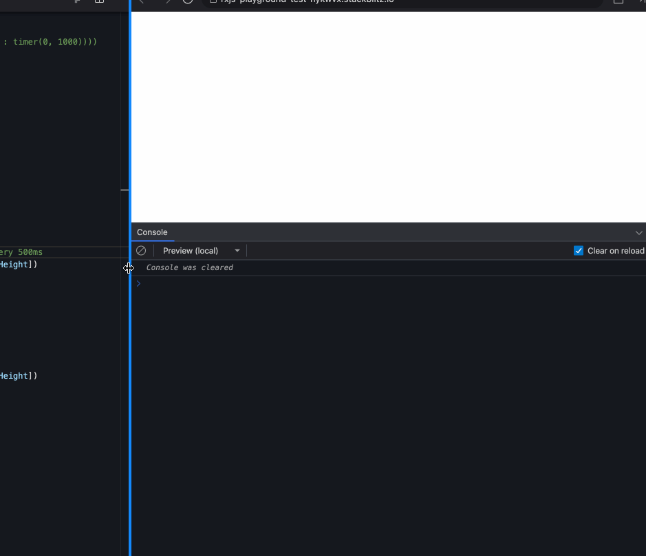
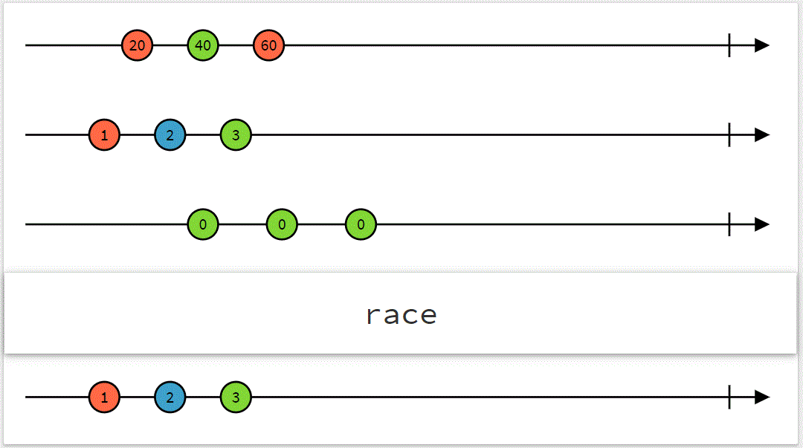
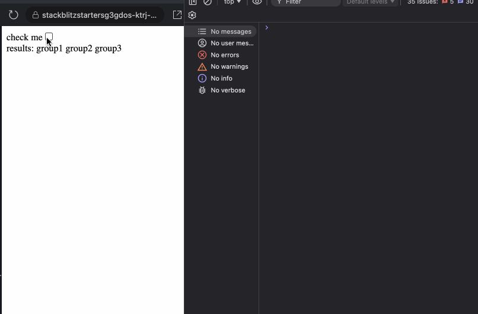
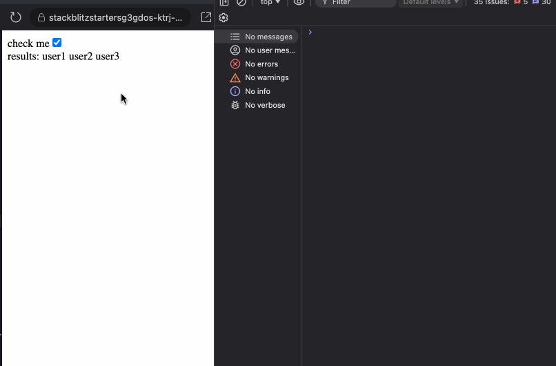

In June 2024, I published an article [Advanced RxJs Operators You Know But Not Well Enough](https://dev.to/krivanek06/advanced-rxjs-operators-you-know-but-not-well-enough-1ela), which received significant attention and many of you found it useful. Since RxJS remains essential in Angular and has a vast number of operators, I decided to create a part 2 of this article to highlight some operators, their combinations, and practical use cases where they can be applied.

In this article, we will explore the following operators:

- forkJoin() vs combineLatest()
- auditTime() vs debounceTime()
- pairwise()
- raceWith()
- iff()
- defer()

## RxJS: forkJoin() vs combineLatest()

Both of these operators deliver the last emitted value from multiple Observables.

The [combineLatest](https://www.learnrxjs.io/learn-rxjs/operators/combination/combinelatest) operator
emits an array of the most recent values from all Observables, only when every Observable has already emitted at leas one value. It combines the latest emitted values from multiple Observables, whenever any observable emits a new value. Keep in mind that sometimes we can subscribe to a cold observable that has <ins>already emitted</ins>, and our `combineLatest()` will never emit.

```TS
combineLatest([
  this.stockPrice$, // emits stock prices
  this.exchangeRate$ // emits exchange rates
]).subscribe(([stockPrice, exchangeRate]) => {
  // will be logged every time any of the above observables emits
  console.log(`Price: ${stockPrice}, Rate: ${exchangeRate}`);
});

```

The [forkJoin](https://www.learnrxjs.io/learn-rxjs/operators/combination/forkjoin) operator waits for all observables to complete, then emits a single array containing the last emitted value from each Observable. If at least one Observable errors or returns `EMPTY` (completes without a value), `forkJoin()` will also throw an error or return `EMPTY`. You may have heard that `forkJoin` is very similar how `Promise.all()` works, as both emit only once when all operations complete.

```TS
forkJoin({
  userProfile: this.api.getUserProfile(),
  userSettings: this.api.getUserSettings(),
  userPreferences: this.api.getUserPreferences()
}).subscribe(({ userProfile, userSettings, userPreferences }) => {
  // will be logged only once, when all of the observables emits
  console.log(userProfile, userSettings, userPreferences);
});
```

One mistake that occasionally happens is that a WebSocket connection is used inside a `forkJoin` operator. You want to avoid doing that because `forkJoin` waits for all its Observables to complete before emitting a value. However, WebSocket-based observables are typically designed to emit values continuously (hot Observables) and never complete unless explicitly unsubscribed.

```TS
forkJoin({
  // API call (completes after fetching data)
  apiData: this.http.get('/api/data'),
  // WebSocket connection (never completes)
  websocketData: this.websocketService.getUpdates()
}).subscribe(result => {
  // will NEVER be logged
  console.log('Result:', result);
});

```

## RxJS: auditTime() vs debounceTime()

For me, these two operators have always been confusing because they are similar, but subtle distinctions make all the difference.

When using [debounceTime](https://rxjs.dev/api/operators/debounceTime), it delays emitting a value from the source observable until there is a "pause" in the emissions for a specified duration. Use it when you want to wait for the user or event to "settle" before taking action.

On the other hand, [auditTime](https://rxjs.dev/api/operators/auditTime) samples the source observable at regular intervals and emits the most recent value from the source observable at the end of each interval. Use it when you need periodic updates while some action is still running.

You are most likely already used to use `debounceTime` on input fields, however `auditTime` may be more useful when tracking resizing or scrolling behavior. Here is an example demonstrating the difference in behavior between these two operators when tracking window resizing. Notice that `auditTime` is emitting values while the user is resizing the window, but `debounceTime` only emits when the user pauses his action.

```TS
// this will emit periodically
fromEvent(window, 'resize')
  .pipe(
    auditTime(500),
    map(() => [window.innerWidth, window.innerHeight])
  )
  .subscribe((dimensions) => {
    console.log(`AUDIT TIME:`, dimensions);
  });

// this emits only when use stops the resizing
fromEvent(window, 'resize')
  .pipe(
    debounceTime(500),
    map(() => [window.innerWidth, window.innerHeight])
  )
  .subscribe((dimensions) => {
    console.log(`DEBOUNCE TIME:`, dimensions);
  });
```



> **_NOTE:_** A helpful utility you can create using closures (Injection token) is a function that returns a signal to listen for window resizing events:

```TS
export const WINDOW_RESIZE_LISTENER = new InjectionToken('Window resize listener', {
  factory: () => {
    const windowRef = inject(WINDOW);

    return toSignal(
      fromEvent(windowRef, 'resize').pipe(
        auditTime(300),
        map(() => windowRef.innerWidth),
        startWith(windowRef.innerWidth),
        takeUntilDestroyed(),
      ),
      { initialValue: windowRef.innerWidth },
    );
  },
});

windowResize = inject(WINDOW_RESIZE_LISTENER);
// ^^ this is a signal
```

Other examples of using `auditTime()` include listening for game inputs or live data streams, events that never stop, where periodic logic execution is desired.

## RxJS: pairwise()

The [pairwise](https://rxjs.dev/api/operators/pairwise) rxjs operator is a transformation operator that emits the previous and current values from an observable as a pair `[previous, current]`. This is useful when you need to compare consecutive values emitted by a source observable.

A useful example might be tracking router changes for navigation improvements.

```TS
import { Router, NavigationEnd } from '@angular/router';
import { filter, pairwise } from 'rxjs/operators';

this.router.events.pipe(
	// filter for NavigationEnd events
  filter(event => event instanceof NavigationEnd),
  // pair consecutive route navigation events
  pairwise()
).subscribe(([previous, current]: [NavigationEnd, NavigationEnd]) => {
  console.log('Previous URL:', previous.url);
  console.log('Current URL:', current.url);
});
```

Another common example is tracking which fields have changed in a form structure.

```TS
@Component({
  selector: 'app-form-tracker',
  standalone: true,
  imports: [ReactiveFormsModule],
  template: `/* .... */`,
})
export class FormTrackerComponent {
  myForm = inject(FormBuilder).nonNullable.group({
    name: '',
    email: '',
    age: '',
  });

  constructor() {
    // track changes in the form
    this.myForm.valueChanges
      .pipe(
        // start with the initial form state
        startWith(this.myForm.value),
        // get the previous and current form values
        pairwise(),
        // get changed fields
        map(([prev, curr]) => this.getChangedFields(prev, curr)),
        // filter only distinct field keys
        scan((acc, curr) => [...new Set([...acc, ...curr])], [] as string[])
      )
      .subscribe((fieldChange) => {
        console.log('Changed fields:', fieldChange);
      });
  }

  /**
   * identify which fields have changed between two states.
   * @returns - name of the field (name, email, age)
   */
  private getChangedFields(previous: any, current: any): string[] {
    return Object.keys(current).filter(
		    (key) => previous[key] !== current[key]
		 );
  }
}
```

## RxJS: race()

The `race()` operator subscribes to multiple observables and emits values from the observable that emits first (and keep listening on), canceling all other subscriptions.



I personally haven’t used the [race()](https://rxjs.dev/api/index/function/race) operator so often, but lately I bumped into a scenario, where it could be considered to be used. Let’s say you are making an API request to an endpoint that is problematic, meaning the request might be stuck in the `pending` state and never resolve (with error or success response). Ideally, you want to wait for a certain period, and if the request is still `pending`, cancel it and show an error message. There are many different solutions for this, but the `race()` operator usage is one that I thought of, here is an example:

```TS
@Component({
  selector: 'app-root',
  standalone: true,
  template: ``,
})
export class App {
  #userAPIService = inject(UserAPIService);

  displayItems = toSignal(
    race(
      this.#userAPIService.getUsers().pipe(
        map((data) => ({
          status: 'loaded' as const,
          data,
        }))
      ),
      of({
        status: 'failed' as const,
      }).pipe(delay(2000))
      // ^^ emit failed status if no response after 2s
    ).pipe(
      startWith({ status: 'loading' as const,})
    ),
    { initialValue: { status: 'loading' } }
  );

  constructor() {
    effect(() => console.log(this.displayItemsSignal()));
  }
}
```

the `displayItem` signal has the immediate value of `{status: 'loading'}` , so you can display the loading state on the UI and then either the API `getUsers()` call is resolved or if the call is still in the `pending` state for more than `2s` then the `{status: 'error'}` value will be emitted and the API call will be cancelled.

Maybe `race()` is a more complex operator for this use case and you want to consider using [timeout()](https://rxjs.dev/api/operators/timeout) operator for the same example. You would end up with:

```TS
displayItemsSignal = toSignal(
  this.userAPIService.getUsers().pipe(
    map((data) => ({
      status: 'loaded' as const,
      data,
    })),
    startWith({
      status: 'loading' as const,
    }),
    timeout({
      each: 1000,
      with: () => of({ status: 'failed' as const }),
    })
  ),
  { initialValue: { status: 'loading' } }
);
```

## RxJS: defer()

The [defer()](https://rxjs.dev/api/index/function/defer) operator allows you to create a new observable on demand. The observable logic is executed only when it is subscribed to, making it evaluated lazily. I personally haven’t seen it being used often, however it may be a good addition to your project if you use a lot of Promises.

An example may be that let’s say you have a service that makes API calls, however instead of using the [httpClient](https://angular.dev/api/common/http/HttpClient) and returning an Observable, it returns a Promise.

```TS
@Injectable({ providedIn: 'root' })
export class UserAPIService {
  #data = [{ name: 'user1' }, { name: 'user2' }, /*...*/];

  getUsersPromise(): Promise<DataItem[]> {
    return new Promise((res) =>
      setTimeout(() => {
        res(this.#data);
      }, 200)
    );
  }
}
```

Now, you want to display a checkbox, and once the checkbox is clicked, you want to load the users (make an API call). You googled how to [convert Promises into Observables](https://stackoverflow.com/questions/39319279/convert-promise-to-observable), and you know you have to use the `from` operator for that, so you end up with a code like the following:

```TS

@Component({
  selector: 'app-root',
  standalone: true,
  imports: [ReactiveFormsModule, AsyncPipe],
  template: `
    <label for="checkBox">check me</label>
    <input type="checkbox" name="checkBox" [formControl]="checkboxControl" />

    @if(checkboxControl.value){
      @for(item of displayItems$ | async; track item.name){
        {{ item.name }}
      }
    }
  `,
})
export class App {
  checkboxControl = new FormControl<boolean>(false, { nonNullable: true });

  displayItems$ = from(this.inject(UserAPIService).getUsersPromise());
}
```

I haven’t found this information in the [rxjs from() docs](https://rxjs.dev/api/index/function/from), however when you use `from()`, it will immediately convert Promises into Observables, which means, the `getUsersPromise()` is executed eagerly, even before the checkbox is clicked.

This behavior may not be a huge drawback, since you want to load the user data regardless. It just depends on the use case whether eager loading is a desired behavior. If you want to wait until the subscription is hit (when the checkbox is clicked) you can use `defer` such as

```TS
displayItems$ = defer(() => from(this.userAPIService.getUsersPromise()))
```

Using [defer()](https://stackoverflow.com/a/38771306), it delays the `getUsersPromise()` execution (making the API call) only when subscription happens.

## RxJS: iif()

There are many use cases when we listen to the emitted values of an Observable and use `switchMap` (or another [higher order observable](https://dev.to/krivanek06/angular-interview-what-is-higher-order-observable-2k03)) with a condition to determine what to return. Here is one example:

```TS

displayItemsSignal = toSignal(
  this.checkboxControl.valueChanges.pipe(
    switchMap((isChecked) =>
      isChecked
        ? this.userAPIService.getUsers()
        : this.groupAPIService.getGroups()
    )
  ), { initialValue: [] });
```

Although this example works fine, you can use the `iif()` operator for syntax sugar if both the `getUsers()` and `getGroups()` return an Observable.

```TS
displayItemsSignal = toSignal(
  this.checkboxControl.valueChanges.pipe(
    switchMap((isChecked) =>
      iif(
        () => isChecked,
        this.userAPIService.getUsers(),
        this.groupAPIService.getGroups()
      )
    )
  ), { initialValue: [] });
```

There is one catch however. Let’s say, that instead of Observables, the service is using Promises for the data retrieval:

```TS
@Injectable({ providedIn: 'root' })
export class UserAPIService {
  #data = [{ name: 'user1' }, { name: 'user2' }, /*...*/];

  getUsersPromise(): Promise<DataItem[]> {
    return new Promise((res) =>
      setTimeout(() => {
        console.log('UserAPIService resolved');
        res(this.data);
      }, 200)
    );
  }
}

@Injectable({ providedIn: 'root' })
export class GroupAPIService {
  #data = [{ name: 'group1' }, { name: 'group2' }, /*...*/];

  getGroupPromise(): Promise<DataItem[]> {
    return new Promise((res) =>
      setTimeout(() => {
        console.log('GroupAPIService resolved');
        res(this.data);
      }, 200)
    );
  }
}
```

and if you are using the `iif()` operator with Promises, such as below

```TS
displayItemsSignal = toSignal(
  this.checkboxControl.valueChanges.pipe(
    switchMap((isChecked) =>
      iif(
        () => isChecked,
        this.userAPIService.getUsersPromise(),
        this.groupAPIService.getGroupPromise()
      )
    )
  ), { initialValue: [] });
```

What will happen is that whether the checkbox is checked, or not, both methods, the `getUsersPromise()` and the `getGroupPromise()` are executed. Definitely not what we desired.



You can fix this problem with 2 solutions. First is going back to the ternary operator such as

```TS
  displayItemsSignal = toSignal(
    this.checkboxControl.valueChanges.pipe(
      switchMap((isChecked) =>
        isChecked
          ? this.userAPIService.getUsersPromise()
          : this.groupAPIService.getGroupPromise()
      )
    ), { initialValue: [] });
```

this fixes the problem when you are working with Promises, however, if you want to use the `iif()` operator, then you should also use the `defer()` operator, to avoid eager execution, like:

```TS
  displayItemsSignal = toSignal(
    this.checkboxControl.valueChanges.pipe(
      switchMap((isChecked) =>
        iif(
          () => isChecked,
          defer(() => this.userAPIService.getUsersPromise()),
          defer(() => this.groupAPIService.getGroupPromise())
        )
      )
    ), { initialValue: [] });
```



To recap, you can freely use the `iif()` conditional operator when working with Observables. However, when you are working with Promises, either use the [Conditional (ternary) operator](https://developer.mozilla.org/en-US/docs/Web/JavaScript/Reference/Operators/Conditional_operator) or combine `iif()` with the `defer()` operator.

## Summary

As the continuation to the first article, I tried to pick operators the either may cause some confusion or they can be useful in very specific situations. I hope you liked the article and feel free to share your thoughts, or connect with me on [dev.to](https://dev.to/krivanek06) | [LinkedIn](https://www.linkedin.com/in/eduard-krivanek).
