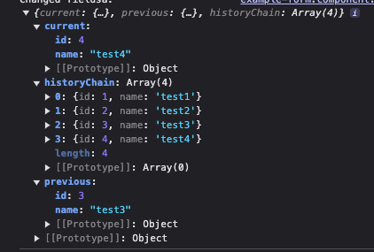
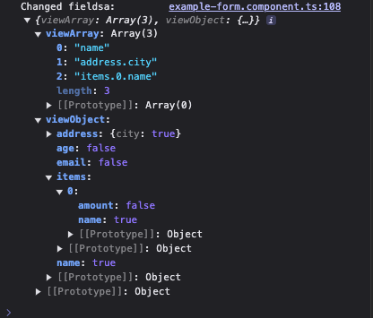
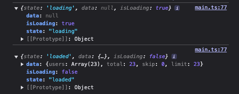

On the recent Angular live interview in January 2025 a question was asked: "[Are we ditching Observables and RxJs?](https://www.youtube.com/live/apyVs0D6rf0?t=3228s)".
A simple answer is that RxJs had became optional, but it is far from obsolete. The introduction of signals has added a new tool to Angular's reactive programming toolbox, but RxJs remains valuable for scenarios involving complex data streams, event handling, and real-time updates.

I've already written two articles in 2024 on Advanced RxJs Operators You Know But Not Well Enough - [part 1](https://dev.to/krivanek06/advanced-rxjs-operators-you-know-but-not-well-enough-1ela) and [part 2](https://dev.to/this-is-angular/advanced-rxjs-operators-you-know-but-not-well-enough-pt-2-3df5), which received positive feedback.
Even though there are plenty of operators to choose from the official RxJs docs, there are times when you wish for a particular operator to solve a unique use case.

In this article, I want to explore how you can create custom RxJs operators and then give you some operators (not just simple loggers) that may be useful to your application. Every operator that will be mentioned in the article can be found in the [Github Repository](https://github.com/krivanek06/stackblitz-rxjs-playground/tree/main/src/custom-rxjs-operators). Those customs operators include:

- `filterNil()` - filters out `null` and `undefined` values from the pipe chain
- `dataPolling()` - poll data from an API in some time interval
- `handleError()` - complex error handling by sending data to Sentry and notifying the user
- `rememberHistory()` - caching last N values and accessing previous state of the received data
- `objectValueChanged()` - deep object comparison, emitting only changed states compared to previous
- `objectChangedFields()` - listing out an object’s (form) changed fields
- `loadingStatus()` - similar to the `rxResource()` API, that works with Observables

## What Is An Operator?

To answer this question, it's best to start by looking at the [Github RxJs implementations](https://github.com/ReactiveX/rxjs/tree/master/packages/rxjs/src/internal/operators) for all available operators. Let’s choose the most common `map()` operator and see how it is being implemented. At the moment of writing this article, in RxJs version 7.8.1, the `map()` operator implementation looks as follows:

```TS
export function operate<In, Out>(
	{ destination, ...subscriberOverrides }: OperateConfig<In, Out>
) {
  return new Subscriber(destination, subscriberOverrides);
}

export function map<T, R>(
	project: (value: T, index: number) => R
): OperatorFunction<T, R> {
  return (source) =>
    new Observable((destination) => {
      // The index of the value from the source.
      let index = 0;
      // Subscribe to the source
      source.subscribe(
        operate({
          destination,
          next: (value: T) => {
            // Call the projection function with the context,
            // and send the resulting value to the consumer.
            destination.next(project(value, index++));
          },
        })
      );
    });
}
```

This is nice and all, but what does this piece of code tell us? My main takeaway is that, the `map()` operator is simple a JavaScript function that returns a specific `OperatorFunction<T, R>` type. The logic what exactly happens inside the function is now irrelevant. What I want to focus on is the returning type. Reading the [return type explanation on Github](https://github.com/ReactiveX/rxjs/blob/master/packages/observable/src/types.ts#L29), the authors explain that there are actually two operator types: `OperatorFunction` and `MonoTypeOperatorFunction`.

The `OperatorFunction` type "_always takes a single parameter (the source Observable) and returns another Observable._”. The reason why this type is used with the `map()` operator is that it takes some sort of generic value `T` as an input and returns a different output `R` value. This actually makes sense as we can write a predicate that transforms the entire shape of the input object `T -> R`.

When the output type is the same type as the input type, we can use the `MonoTypeOperatorFunction`. It’s description says “_A function type interface that describes a function that accepts and returns a parameter of the same type._”.

Also worth pointing out that the `source` variable represents the Observable passed into the operator function when it is invoked within a pipe chain. Meaning when you use the `source.subscribe(value => ... )` then `value` represents the data flowing through the pipe chain into this function.

## Start With Basics

End of the theory, let's dive into something practical to understand the basics. To create a simple custom operator, let’s say that we have a stream of numbers and want to multiply them by a specific value. Here's the result we aim to achieve:

```TS
const source$ = of(1, 2, 3);
source$.pipe(multiplyBy(6)).subscribe(console.log);
//  6, 12, 18
```

From what we know so far, we can create something like this:

```TS
export function multiplyBy(val = 2): MonoTypeOperatorFunction<number> {
  return (source: Observable<number>): Observable<number> =>
    new Observable<number>((subscriber) => {
      return source.pipe(map((d) => d * val)).subscribe({
        next(value) {
          subscriber.next(value);
        },
        error(err) {
          subscriber.error(err);
        },
        complete() {
          subscriber.complete();
        },
      });
    });
}
```

The function name is `multiplyBy()` which is used inside a pipe chain. It returns a `MonoTypeOperatorFunction` type because, although we modify the data, the type remains the same. Inside the function, we subscribe to the current Observable to access the values flowing through the pipe chain and return a new Observable.

This implementation works fine, however, I didn’t like this extra layer of abstraction by creating an additional Observable wrapping around the `source` Observable, and also explicitly subscribing to the `source`. This approach is useful if we need full control over subscription management or have complex custom logic. Since none of these apply to our code, we can simplify our custom operator as follows:

```tsx
export function multiplyBy(val = 2): MonoTypeOperatorFunction<number> {
  return source => source.pipe(map(d => d * val));
}
```

The shorter syntax is more readable, so I will continue with it to list out some operators that may be useful in your projects, starting from simple ones up to more complicated ones.

## Custom RxJs Operators

### 1.) Filter Nil

The inspiration for this operator came from the [ngxtension](https://ngxtension.netlify.app/utilities/operators/filter-nil/) library, that I used for some time and I do recommend checking it out. The idea is that we want to filter out `undefined` and `null` values from a pipe chain.

```TS
export function filterNil<T>(): MonoTypeOperatorFunction<T> {
  return (source) => source.pipe(
	  filter((d) => d !== null && d !== undefined)
	 );
}
```

### 2.) Data Polling

There are situations where you loaded data from an API, cached it, but you wanted to poll the server in some time interval, thought the lifetime of the application, to refresh the data - weather app, stock prices, message polling etc. What I found out was, that it was pretty easy to implement such an operator:

```TS
export function dataPolling<T>(data: {
  loader: () => Observable<T>;
  reloadSeconds: number;
}): MonoTypeOperatorFunction<T> {
  return (source) =>
    source.pipe(
      switchMap(() =>
        timer(0, data.reloadSeconds * 1000).pipe(
          switchMap(data.loader)
        )
      )
    );
}
```

```TS
// Component
private http = inject(HttpClient);

constructor() {
  const api = '...'
  this.http.get(api)
    .pipe(
      dataPolling({
         reloadSeconds: 10,
         loader: () => this.http.get(api),
      }),
    ).subscribe((x) => console.log(x));
}
```

### 3.) Complex Error Handling

I know I said I won’t do examples with logging, as you can find more than enough of it, however I think it is worth mentioning that when you are doing some more complex logic inside the `catchError()` operator, it makes sense to create a custom operator for it. Here is an example of reporting the logs into Sentry and also notifying the user when something goes wrong.

```TS
export function handleError<T, K>(
  returnValue: K,
  errorMessage = "Server Error"
): OperatorFunction<T, K | T> {
	const sentry = inject(SentryService);
	const notification = inject(NotificationService);

  return (source) =>
    source.pipe(
      catchError((err) => {
	    // log error in sentry
		sentry.log(error, 'error')

		// notify the user
		notification.notifyUser(errorMessage, 'error')

		// return something in the pipe chain
        return of(returnValue);
      })
    );
}
```

### 4.) Remember History

Have you ever had a situation that you wanted to create an “undo change” button? Maybe caching values that arrived via a Websocket connection, or remember last N form edits by the user? One simple version for caching data can be done as follows:

```TS
// defining an interface for the function
// current and crevious values can be different, therefore T & K
type RememberMemory<T, K = T> = {
	// previous value that was cachced
  previous: null | K;
  // currently cached value
  current: T;
  // previous N cached values
  historyChain: unknown[];
};
```

```TS
export function rememberHistory<T>(
	// how many last N values to remember
  memory = 3
): OperatorFunction<T, RememberMemory<T>> {
  return (source) =>
    source.pipe(
      scan(
        (acc, curr) => ({
          current: curr,
          previous: acc.current,
	        // remember last N values
          historyChain: [...acc.historyChain.slice(-(memory - 1)), curr],
        }),
        {
          current: null as T, // ignore initial null
          previous: null,
          historyChain: [],
        } as RememberMemory<T>
      )
    );
}
```

To demonstrate how this pipe works, let’s say you have a stream of data and you want to cache them. When you have the following code, it will result to the below displayed picture. You can also change the logic if you want to change the order in the `historyChain` to keep the latest data on the first and not on the last position in the array.

```TS
from([
  { id: 1, name: "test1" },
  { id: 2, name: "test2" },
  { id: 3, name: "test3" },
  { id: 4, name: "test4" },
]).pipe(
    rememberHistory(4)
  )
```



### 5.) Object Value Change

When working with forms, you might listen to the form's `valueChanges` and only perform specific computations when the form is actually updated. The goal is to ignore intermediate changes, like typing or deleting characters, and only respond to meaningful updates. To solve this you could reach out for `distinctUntilChanged()` with some predicate and write it as:

```TS
this.myForm.valueChanges.pipe(
  debounceTime(800),
  distinctUntilChanged(
    (prev, curr) => JSON.stringify(prev) === JSON.stringify(curr)
  ),
  map(d => /* do something */ )
 )
```

Using the stringifycation predicate, you are creating a guard to proceed only when the form was updated from it’s previous state. This predicate performs a deep comparison, which also includes checking form arrays and nested form groups.

But what if you need this logic, but you wish to avoid using `JSON.stringify` ? You’d want a way to compare the previous and current object states, emitting only when they differ. Restricting the usage of `distinctUntilChanged()` and write out a custom logic to compare object changes can be done as follows:

```TS
/**
 * creates a deep comparison between previous and current state
 * and emits only when object values changed (even for nested keys)
 */
export function objectValueChanged<T extends Object>(
  config: {
    debounceTime: number;
  } = {
    debounceTime: 500,
  }
): MonoTypeOperatorFunction<Partial<T>> {
  const isObjectValueChange = <K extends Object | {}>(
    prev: K,
    curr: K
  ): boolean => {
    return Object.keys(curr).some((key) => {
      // value can be anything - string, number, object, etc.
      const previousValue = prev[key as keyof K] as any;
      const currentValue = curr[key as keyof K] as any;

      // if value is object - check child key and value changes
      if (currentValue instanceof Object) {
        return isObjectValueChange(previousValue, currentValue);
      }

      return previousValue !== currentValue;
    });
  };

  return (source) =>
    source.pipe(
      // start with empty object make first emit
      startWith({}),
      // wait for user's input typing
      debounceTime(config.debounceTime),
      // use previous and current object values
      pairwise(),
      // only filter changed values for the object
      filter(([prev, curr]) => isObjectValueChange(prev, curr)),
      // return current object
      map(([_, curr]) => curr)
    );
}
```

### 6.) Object Field Changes

Speaking about forms, a more practical use case could be listening to a form and determining which fields have been changed / edited. The goal is to pass the initial state of the form (or object) into the pipe and get two outputs: an array of changed keys and an object where the keys are form field names and the values are booleans indicating if the field was edited. This pipe is indeed more complex, you don’t need to understand it in depth. Below I demonstrate how it works when attaching it on a form.

```TS

type Booleanify<T> = {
  [K in keyof T]: T[K] extends object ? Booleanify<T[K]> : boolean;
};

export function objectChangedFields<T extends Object>(
  initial: T
): OperatorFunction<
  Partial<T>,
  {
    viewArray: string[];
    viewObject: Booleanify<T>;
  }
> {
  // identify which fields have changed between two states.
  const getChangedFields = <K extends Object | Array<any>>(
    initial: K,
    current: Partial<K>,
    currentKey = ""
  ): string[] => {
    let changedKeys: string[] = [];
    for (const key of Object.keys(current)) {
      // value can be anything - string, number, object, etc.
      const previousValue = initial[key as keyof K] as any;
      const currentValue = current[key as keyof K] as any;

      // create key to save
      const newKey = currentKey !== "" ? `${currentKey}.${key}` : key;

      // if value is object - check child key and value changes
      if (currentValue instanceof Object) {
        // save nested path
        changedKeys.push(
          ...getChangedFields(previousValue, currentValue, newKey)
        );
        // go to next key
        continue;
      }

      // string or number comparison
      if (previousValue !== currentValue) {
        changedKeys.push(newKey);
      }
    }

    // return saved keys
    return changedKeys;
  };

  // identify which fields have changed between two states.
  const getChangedFieldsObject = <K extends Object>(
    initial: Partial<K>,
    current: Partial<K>,
    cachedObj = {}
  ): Booleanify<K> => {
    for (const key of Object.keys(initial)) {
      // value can be anything - string, number, object, etc.
      const previousValue = initial[key as keyof K] as any;
      const currentValue = current[key as keyof K] as any;

      // if value is object - check child key and value changes
      if (currentValue instanceof Object) {
        // create nested object
        (cachedObj as any)[key] = {};
        // access nested cache
        const nestedCache = (cachedObj as any)[key];
        // check if nested key changed
        getChangedFieldsObject(previousValue, currentValue, nestedCache);
        // go to next key
        continue;
      }

      // string or number comparison
      (cachedObj as any)[key] = previousValue !== currentValue;
    }

    return cachedObj as Booleanify<K>;
  };

  return (source) =>
    source.pipe(
      map((data) => ({
        viewArray: getChangedFields(initial, data),
        viewObject: getChangedFieldsObject(initial, data),
      }))
    );
}
```

I won’t dive into the details of how it works, there are some `any` castings and probably if you spend enough time on this, you could make it cleaner, but I’ve linked the GitHub repository at the end for those interested.

What’s important is that you pass the initial state of the object (form) as `initial: T` to the function. The two functions, `getChangedFields()` returns an array of keys which were affected, and `getChangedFieldsObject()` returns an object with boolean values if the key was. changed. Now, let’s see this pipe in action with the following component:

```TS
export class ExampleFormComponent {
  private readonly builder = inject(FormBuilder);

  myForm = this.builder.nonNullable.group({
    name: [""],
    email: [""],
    age: [""],
    address: this.builder.group({
      city: [""],
    }),
    items: this.builder.array([
      this.builder.group({
        name: [""],
        amount: [0],
      }),
    ]),
  });

  constructor() {
    this.myForm.valueChanges.pipe(
        objectChangedFields(this.myForm.value)
      ).subscribe((fieldChange) => {
        console.log("Changed fieldsa:", fieldChange);
      });
  }
}
```

I am passing the `this.myForm.value` initial state to the custom pipe, but this can be any object to which I want to compare the pipe chain data into. For instance, if the `name`, `address.city` and `items[0].name` fields will be changed, the `objectChangedFields()` will return the following:



### 7.) Loading Stats

In November 2024 I published an article titled [Creating Custom rxResource API With Observables](https://dev.to/this-is-angular/creating-custom-rxresource-api-with-observables-2abm), where I attempted to recreate a custom `rxResource()` API that works with Observables instead of signals. The main benefit of this custom API is that, even when working with Observables, you still get access to the loading state of the HTTP request. What I also realized is that I can take this logic and create a custom pipe that includes these HTTP status indicators.

```TS
type RxResourceResult<T> = {
  state: "loading" | "loaded" | "error";
  isLoading: boolean;
  data: T | null;
  error?: unknown;
};
```

```TS
/**
 * used mainly for API requests to include HTTP state and additional data
 * about the HTTP call. Similar to rxResource
 */
 export function loadingStatus<T>(): OperatorFunction<T, RxResourceResult<T>> {
  return (source) =>
    source.pipe(
      map((result) => ({
        state: "loaded" as const,
        data: result,
      })),
      // setup loading state
      startWith({
        state: "loading" as const,
        data: null,
      }),
      // handle error state
      catchError((error) =>
        of({
          state: "error" as const,
          error,
          data: null,
        })
      ),
      // map the result to the expected type
      map(
        (result) =>
          ({
            ...result,
            isLoading: result.state === "loading",
          } satisfies RxResourceResult<T>)
      )
    );
 }
```



## Summary

RxJs already provides bunch of operators to manipulate data in the pipe chain, however, occasionally it happens that you need to create a custom, more specific pipe. From this article, you learned that operators are just simple functions that return either `OperatorFunction` when the input and output types are different, or `MonoTypeOperatorFunction` when they stay the same type.

You also have seen a few examples where custom operators could be useful. Personally, I find the `objectChangedFields()` and `loadingStatus()` operators to be the most useful. I hope you liked the article. You can find all the above mentioned, and more custom pipe on the following [Github repository](https://github.com/krivanek06/stackblitz-rxjs-playground/tree/main/src/custom-rxjs-operators). Feel free to share your thoughts, and connect with me on [dev.to](https://dev.to/krivanek06) | [LinkedIn](https://www.linkedin.com/in/eduard-krivanek)
