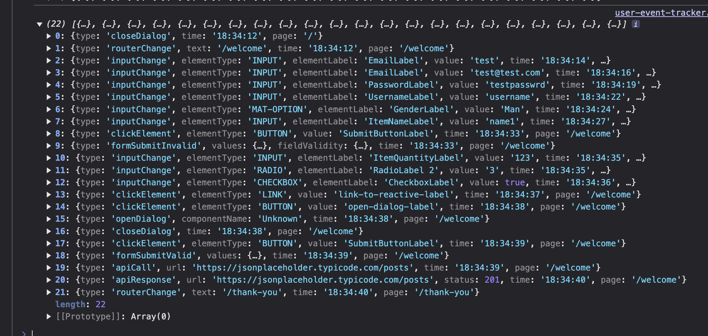
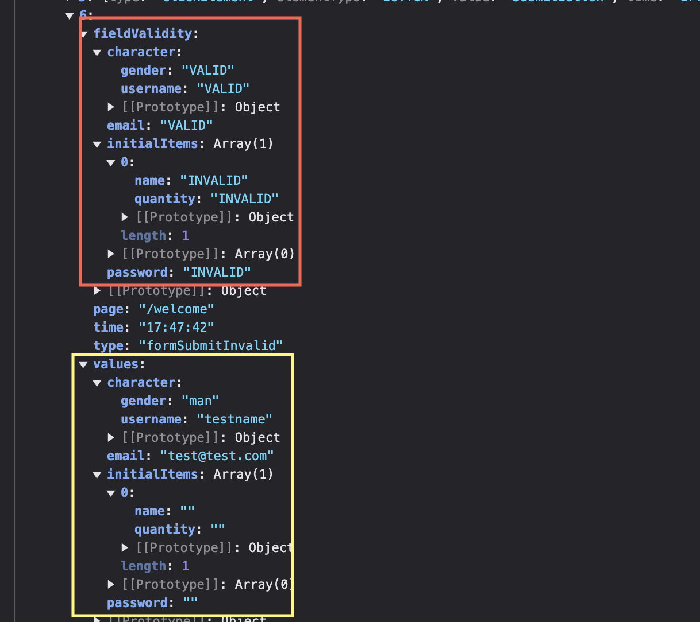

Recently, in the company I am working for, we had a task to implement an user event logger. The problem was that we weren’t sure how the customer is using our app. We needed to track user behavior to understand why certain HTTP actions were being triggered. The task was a bit abstract, but we had to fulfill the following requirements:

- Log every single input value change
- Track every form submission, regardless of validity
- Capture every router navigation change
- Monitor dialog open and close events
- Log all incoming and outgoing HTTP requests
- Aggregate logs into chunks to optimize storage
- Save logs when the application is refreshed/closed

While there are many 3rd party providers, or even NPM libraries to choose from, we wanted to have a local event tracker that can be customized based on our needs. In this article, I’ll go through a real world problem, the different approaches we considered, and the final solution we implemented.

The logger is quite generic, hence the reason for this article. If you have a similar problem, you may find some inspiration here. The code is available on [Github Repository](https://github.com/krivanek06/stackblitz-angular-user-event-logging). The article will be rich with code snippets, but I won’t explain every part of the code, as I assume the reader have a basic knowledge of declarative programming, RxJs operators and Angular’s fundamentals.

## The End Result

Before diving deep into the article I want to show a picture about the final result. As users interact with the application, changing form values, opening dialogs, submitting forms, clicking buttons, and more, every action is logged.



## Initial Brainstorming

When brainstorming a solution for this problem, to handle HTTP requests, the answer was obvious, we needed to create an interceptor. The problem was to track input value changes, which included: text fields, text areas, selects, radio buttons, button clicks, etc. We considered two approaches:

1. **Multiple Directives** – Creating separate directives for different HTML elements, such as `@Directive({ selector: 'input, textarea' })`.
2. **A Centralized Service** – Injecting the `DOCUMENT` token (`document = inject(DOCUMENT)`) into a service, setting up a global event listener, and identifying which HTML element was clicked or focused.

While directives are great for targeting specific elements, a major drawback (for us) was that each directive had to be explicitly imported into every standalone component. To keep things simple, we went for the "one service to rule them all" approach, though we still used directives in some edge cases. In the following sections, I'll walk you through our solution.

## Event Accumulator

To start with the basics, we first needed a service to collect and store all generated logs before sending them to the server when the application closed. This part of the solution was relatively simple, and we ended up with the following approach:

```TS
@Injectable({
  providedIn: 'root',
})
export class UserEventTrackerService {
  private readonly router = inject(Router);

  /** trigger when an user event happens that we want to log */
  private readonly accumulateLog$ = new Subject<LogEventAction>();

  /** trigger to reset the accumulated logs */
  private readonly resetLogs$ = new Subject<void>();

  /** accumulate every user event that happens */
  private readonly accumulatedLogs = toSignal(
    merge(
      // triggered logs by the app
      this.accumulateLog$.pipe(
        map((action) => ({
          type: 'add' as const,
          action: { ...action, time: new Date(), page: this.router.url },
        })),
      ),
      // reset logs
      this.resetLogs$.pipe(map(() => ({ type: 'reset' as const }))),
    ).pipe(scan((acc, curr) =>
		(curr.type === 'add' ? [...acc, curr.action] : []), [] as UserEvent[])
	  ),
    { initialValue: [] },
  );

  createLog(action: LogEventAction): void {
    this.accumulateLog$.next(action);
  }

  saveLogs(): void {
    const logChunks = createChunks(this.accumulatedLogs(), 120)

    // save all log chunks
    for (const logFormat of logChunks) {
      this.sendToRemoteByFetch(logFormat);
    }

	// trigger reseting all previous logs
    this.resetLogs$.next();
  }

  private sendToRemote(body: unknown): void {
	// todo ....
  }
}
```

In the `UserEventTrackerService`, we expose two public interfaces. When we want to create a new log, we call the `createLog()` method. Not exposing the `accumulateLog$` subject, but rather wrapping it inside the `createLog()` method prevents unnecessary abuse such as calling `accumulateLog$.complete()` for whatever reason. The `LogEventAction` type helps categorize and distinguish different types of logs. While not the main focus of this article, for context, the `LogEventAction` looks something like this:

```TS
// the code is reduced for the sake of article
export type LogEventAction =
  | {
      type: 'inputChange';
      // input, select, checkbox
      elementType: string;
      // label of the element
      elementLabel: string;
      // input value
      value: string | boolean | number;
    }
  | {
      type: 'clickElement';
      elementType: string;
      value: string;
    }
  | {
      type: 'routerChange';
      text: string;
    }
  | {
      type: 'apiCall';
      url: string;
    }
   | {
	   type: 'custom';
	   value: unknown;
   }
   // .....

export type UserEvent = {
  // time when the user event happens - HH:mm:ss
  time: string;
  // current page that the user is on
  page: string;
} & LogEventAction;
```

Therefore, if we want to create a log, all we have to do in a component is:

```TS
export class TestComponent {
	private trackingService = inject(UserEventTrackerService);

	createLog(){
		this.trackingService.createLog({ type: 'custom', value: 'AA' })
	}
}
```

The other exposed API in `UserEventTrackerService` is `saveLogs()`. This method sends logs to the server in chunks (which I'll explain in the next section) and triggers `resetLogs$` to clear previously stored logs.

At first glance, `resetLogs$` might seem unnecessary since logs should be accumulate on the client until the app is closed. However, in our use case, we needed to also send logs when the user refreshed the application, clear previous ones, and start accumulating logs again.

```TS
export class App {
  private userEventTrackerService = inject(UserEventTrackerService);

  @HostListener('window:beforeunload')
  onPageRefresh() {
    this.userEventTrackerService.saveLogs();
  }
}
```

### Sending Logs To The Server

At first, you might think sending data to the backend is as simple as injecting `HttpClient` and calling `post()`, which would create an [XMLHttpRequest](https://developer.mozilla.org/en-US/docs/Web/API/XMLHttpRequest_API/Using_XMLHttpRequest) to save the data. However, the issue with XHR is that it gets canceled if the browser is closed and no analytics would be saved.

There are two better alternatives. The first is the [sendBeacon() Navigator API](https://developer.mozilla.org/en-US/docs/Web/API/Navigator/sendBeacon), which allows sending a POST request even when the page is unloading (closing). The downside is that `sendBeacon()` doesn’t allow headers, authentication or cookies to be included in the request.

The second and more flexible approach is using a standard `fetch()` request, where we can set up custom headers and enable the [keepalive property](https://developer.mozilla.org/en-US/docs/Web/API/Request/keepalive) by setting it to `true`. It's important to note that the request will be sent to the server when the application is closed/refreshed, but its success depends entirely on the server. This means that the frontend resets the accumulated logs once the request is issued, and if the server fails to complete the request, the logs will be lost.

```TS
  private sendToRemote(body: unknown): void {
    const xsrfToken = this.getCookie('XSRF-TOKEN');

    fetch('api/logs', {
      method: 'POST',
      headers: {
        'Content-Type': 'application/json',
        ...(xsrfToken ? { 'X-XSRF-TOKEN': xsrfToken } : {}),
      },
      credentials: 'include',
      keepalive: true, // keep the connection alive when app closes
      body: JSON.stringify(body),
    });
  }
```

## Component HTML Structure

You can think of our application as an airline ticketing portal, a form based system spread across multiple routes, where users input details step by step, the final page is the checkout page, however the user can cancel his order on any step.

```HTML
<form [formGroup]="form" (ngSubmit)="onSubmit()">
	<mat-form-field>
	  <mat-label>Email</mat-label>
	  <input matInput formControlName="email" />
	</mat-form-field>

	<mat-form-field>
	  <mat-label>Gender</mat-label>
	  <mat-select formControlName="gender">
	    <mat-option value="man">Man</mat-option>
	    <mat-option value="woman">Woman</mat-option>
	  </mat-select>
	</mat-form-field>

	<mat-radio-group>
	  <mat-radio-button value="1">Option 1</mat-radio-button>
	  <mat-radio-button value="2">Option 2</mat-radio-button>
	</mat-radio-group>

	<button mat-stroked-button type="submit">Submit</button>
</form>
```

The challenge is that even if you set up click or focus listeners on these HTML elements, you need to capture two key pieces of information:

1. The **value -** inside the HTML element (which is relatively easy to retrieve).
2. The **associated label** - of the HTML element (which is much harder to obtain).

Labels are tricky because, for elements like `input` or `mat-select`, the label is usually positioned next to the element. But what about radio buttons, checkboxes, or standard buttons? What counts as their label?

Your first instinct might be to use the text inside the element. For example, a `button` labeled "Submit" would store `"Submit"` as its label. But this introduces a new challenge: localization. If the app supports multiple languages, debugging user events becomes more complex since the label text would be different depending on the language. What’s labeled `"Submit"` in English might be `"Enviar"` in Spanish or `"Soumettre"` in French, making it harder to track and analyze events consistently across different locales.

### Naming HTML Elements

One solution that was proposed, though not ideal, was to apply [aria-label to name elements](https://developer.mozilla.org/en-US/docs/Web/Accessibility/ARIA/Attributes/aria-label). This approach required manually adding `aria-label` (or any kind of selector) to buttons, inputs, selects, and any other interactive elements we wanted to track.

The `aria-label` enhances accessibility, however it can confuse screen readers if the naming is incorrect. Additionally, it should always be localized. I heard a saying which goes "a website without arial is still better than a website full of false ones". The goal is to have a selector that remains in English and is ignored by screen readers. Instead of using `aria-label` selector, we can introduce the [data-label attribute](https://developer.mozilla.org/en-US/docs/Learn_web_development/Howto/Solve_HTML_problems/Use_data_attributes).

```HTML
<form [formGroup]="form" (ngSubmit)="onSubmit()">
	<mat-form-field>
	  <mat-label>Email</mat-label>
	  <input data-label="Email" matInput formControlName="email" />
	</mat-form-field>

	<mat-form-field>
	  <mat-label>Gender</mat-label>
	  <mat-select formControlName="gender">
	    <mat-option data-label="Gender" value="man">Man</mat-option>
	    <mat-option data-label="Gender" value="woman">Woman</mat-option>
	  </mat-select>
	</mat-form-field>

	<mat-radio-group data-label="RadioLabel 1" formControlName="radioEx1">
	  <mat-radio-button value="1">Option 1</mat-radio-button>
	  <mat-radio-button value="2">Option 2</mat-radio-button>
	</mat-radio-group>

	<button data-label="SubmitButton" mat-stroked-button type="submit">
		Submit
	</button>
</form>
```

In my opinion, `data-label` would be the best approach to name elements, however if it is not feasible, in that case maybe keep using the nearest text to the component as its label and ignore the localization problem.

I also want to highlight the position of `data-label` on different elements, such as `mat-select`. When opening mat-select, it creates an overlay where the options are displayed. However, this overlay prevents access to the `data-label` attribute if it is placed on the `mat-select` itself, making it difficult to retrieve. Therefore, applying it to the `mat-option` proved to be a more effective solution for reading the label of the select.

## Create Global Listeners

The simplest approach to tracking HTML element interactions was to create a single service that listens to DOM events and logs interactions based on the element type. There were several iterations, but our first merged version has a similar structure to this:

```TS
@Injectable({
  providedIn: 'root',
})
export class UserEventListenerService {
  private readonly userEventTrackerService = inject(UserEventTrackerService);
  private readonly document = inject(DOCUMENT);
  private readonly ngZone = inject(NgZone);
  private readonly router = inject(Router);
  private readonly dialog = inject(MatDialog);

  start() {
    afterNextRender(() => {
      merge(
        // open dialog log
        this.dialog.afterOpened.pipe(map((dialogRef) => ({ type: 'openDialog' }))),
        // close dialog log
        this.dialog.afterAllClosed.pipe(map(() => ({ type: 'closeDialog' }))),
        // router change log
        this.router.events.pipe(
          filter((e): e is NavigationEnd => e instanceof NavigationEnd),
          map((routerData) => ({ type: 'routerChange', text: routerData['url'] })),
        ),
      ).subscribe((res) => this.userEventTrackerService.createLog(res));

      this.ngZone.runOutsideAngular(() => {
        // listen on click events
        this.document.addEventListener('click', (event) => {
        const target = event.target as HTMLElement;

          if (target.tagName === 'A') {
            this.userEventTrackerService.createLog({
              type: 'clickElement',
              elementType: 'LINK',
              value: target.dataset['label'] ?? 'Unknown',
            });
          }
          // ... other elements

        }, true);

        // listen on input change events
        this.document.addEventListener('change', (event) => {
          const target = event.target as HTMLElement;

          if (target.tagName === 'INPUT') {
            this.userEventTrackerService.createLog({
              type: 'inputChange',
              elementType: 'INPUT',
              elementLabel: target.dataset['label'] ?? 'Unknown',
              value: (target as HTMLInputElement).value,
            });
          }
          // ... other elements

        }, true);
      });
    })
  }
}
```

The real service is obviously larger and there are multiple conditions to distinguish what type of (`tagName`) HTML element was interacted with. This is a reduced version for better overview. A few key points to highlights:

- **Merging Observables:** The `merge()` operator to combine logs for dialog open/close events, as well as navigation changes to capture them.
- **Event Listeners for Click & Value Changes:** The `addEventListener` listens for both clicks and value changes, and conditionally log the HTML element interactions based on the `tagName`. Additionally, the [capture phase is set to `true`](https://developer.mozilla.org/en-US/docs/Web/API/EventTarget/addEventListener) so the event is caught as it bubbles up. Without this, some events, like radio button changes, weren't caught.
- **Running Outside Angular's Change Detection:** The [runOutsideAngular](https://angular.dev/api/core/NgZone) executes tasks outside Angular’s change detection cycle for performance reasons. It’s generally a good practice to prevent unnecessary re-renders.
- **Prevent SSR Failure**: The [afterNextRender](https://angular.dev/api/core/afterNextRender) is triggered only on the client side, once by Angular finishes rendering. It's a recommended way to register a callback that manipulates with DOM elements.

The major benefit of this approach is that we have one globally registered service that will handle the whole application logging as the user interacts with DOM element.

```TS
bootstrapApplication(App, {
  providers: [
	// ... other things ...
    provideAppInitializer(() => {
      inject(UserEventListenerService).start();
    }),
  ],
});
```

## Using Directives for More Specific Use Cases

The slight problem, at least I couldn’t solve, was that not everything is possible to handle globally. Example is form submission. While you can still setup global listener on the `submit` event, and you can get even the validity, I couldn’t get the form structure, the form control names and the values inside the form.

```TS
this.document.addEventListener('submit', (event) => {
  const formElement = event.target as HTMLFormElement;

  const isValid = formElement.checkValidity();
  const formStructure = "Dunno"; // please help
}, true);
```

The problem is that the `event.target` is a type of `HTMLFormElement`, and ideally we want the `FormGroup` type to then get the form’s `value`. To handle a use case like this directives are the best answerers.

```TS
@Directive({
  selector: 'form[formGroup]',
  standalone: true,
  host: {
    '(ngSubmit)': 'onSubmit()',
  },
})
export class FormSubmitDirective {
  private formGroupDirective = inject(FormGroupDirective);
  private userEventTrackerService = inject(UserEventTrackerService);

  onSubmit() {
    const form = this.formGroupDirective.form;
    const isValid = form.valid;
    const values = form.getRawValue();

    if (isValid) {
      this.userEventTrackerService.createLog({
        type: 'formSubmitValid',
        values,
      });
    } else {
      this.userEventTrackerService.createLog({
        type: 'formSubmitInvalid',
        values,
        fieldValidity: getFormValidationState(form),
      });
    }
  }
}
```

To use the `FormSubmitDirective` directive, you have to import it into each standalone component that displays the form. The `ngSubmit` can be triggered as long as the `<form>` tag is properly formed and contains some interactive element, via keyboard or clicking on the submit button `<button type="submit">Submit</button>`, otherwise the directive will not catch the form submission.

The `getFormValidationState()` is a custom util that goes thought the whole form structure, keep the form keys, but replace the values with a `VALID / INVALID` string whether the field is filled properly.

```TS
type ValidationState =
  | 'VALID'
  | 'INVALID'
  | { [key: string]: ValidationState }
  | ValidationState[];

const getFormValidationState = (form: AbstractControl): ValidationState => {
  if (form instanceof FormControl) {
    return form.valid ? 'VALID' : 'INVALID';
  }

  if (form instanceof FormGroup) {
    return Object.keys(form.controls).reduce(
      (acc, key) => ({
        ...acc,
        [key]: getFormValidationState(form.controls[key]),
      }),
      {},
    );
  }

  if (form instanceof FormArray) {
    return form.controls.map((control) => getFormValidationState(control));
  }

  // default use case, shouldn't happen
  return 'INVALID';
};
```

When submitting an invalid form, where required fields are left empty (or they have any validation error), the form’s invalid state will generate a log like the following:



### Directives For Input Changes

You may be wondering why didn't we initially go with directives for HTML element changes, something like this

```TS
@Directive({
  selector: 'input, textarea',
  standalone: true,
  host: {
    '(change)': 'onChange($event)',
  },
})
export class EventInputsDirective {
  private readonly userEventTrackerService = inject(UserEventTrackerService);

  onChange(event: FocusEvent) {
    const inputTarget = event.target as HTMLInputElement | HTMLTextAreaElement;
    const labelName = inputTarget.dataset['label'] ?? 'Unknown';

    this.userEventTrackerService.createLog({
      type: 'inputChange',
      elementType: inputTarget.tagName,
      elementLabel: labelName,
      value: inputTarget.value,
    });
  }
}
```

This would indeed work. The only drawback we saw was that you would have to import this (and other) directives into each standalone component that you want to track compared to the service that handles input changes globally.

## Catch Network By Interceptors

You're likely already familiar with interceptors, but for the sake of completeness, let’s quickly demonstrate how to capture incoming and outgoing requests. The log will capture the full URL, status codes, and the time taken, allowing you to analyze the time between when the request is sent and when the response is received.

```TS
export const userEventLoggingInterceptor = (
  req: HttpRequest<unknown>,
  next: HttpHandlerFn,
): Observable<HttpEvent<unknown>> => {
  const service = inject(UserEventTrackerService);

  return next(req).pipe(tap((event) => {
      // send http event
      if (event.type === HttpEventType.Sent) {
        service.createLog({ type: 'apiCall', url: req.urlWithParams });
      }
      // receive http event
      else if (event.type === HttpEventType.Response) {
        trackingService.createLog({
          type: 'apiResponse',
          url: req.urlWithParams,
          status: event.status,
        });
      }
    }),
  );
};
```

```TS
bootstrapApplication(App, {
  providers: [
    provideHttpClient(withInterceptors([userEventLoggingInterceptor])),
    // ... other ...
   ]
 })
```

## Summary

In this article I tried to go though a real life web application problem and propose a suitable solution to it. The steps cover how to create a general service that listens on DOM element interactions, identify HTML elements with `data-label`, create an interceptor to catch network calls, use directives for elements which can not be covered globally, or just manually next a subject to create a custom log.

The last thing I want to briefly touch on is that collecting user data may violate GDPR, so you should obtain user consent before proceeding with data collection.

I hope you liked this article. The whole event tracker is [available on Github](https://github.com/krivanek06/stackblitz-angular-user-event-logging), you are free to use it in your own projects. Feel free to share your thoughts, read more from me on [dev.to](https://dev.to/krivanek06) or connect with me on [LinkedIn](https://www.linkedin.com/in/eduard-krivanek).
