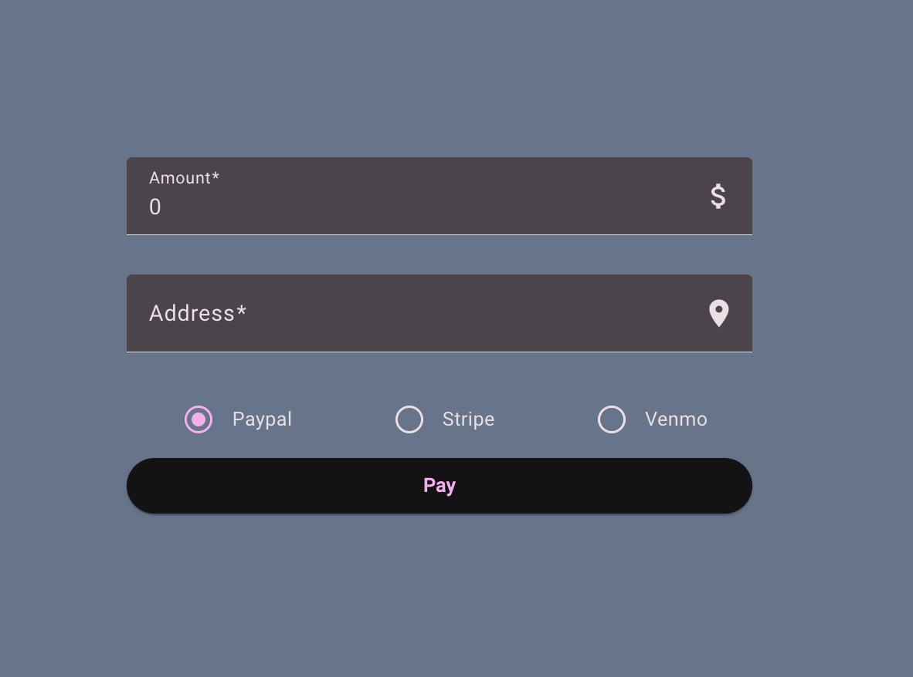

Recently, I came across the following [dynamic service instantiation in Angular](https://www.linkedin.com/posts/roberto-heckers-2313453b_angular-activity-7274362560110379008-fFuj) from [Roberto Heckers](https://www.linkedin.com/in/roberto-heckers-2313453b/), where he generates a service based on some condition. Occasionally, we bump into a use case where you have multiple services, each of them sharing the same method name with a different implementation, and you want to call only one of these services based on some condition. In the following article, I decided to create a similar example and provide more use cases where dynamic service generation may be useful.

## Application Overview

Let’s have an example of a money-sending application (Wise, Paysend, etc.). You want to send some amount to your friend. You are required to put the amount, the address, and select what kind of payment option you want to use. Here is the ugly version of the UI and the HTML and TS part of the form.



```html
<form [formGroup]="form" (ngSubmit)="onSubmit()">
  <!-- payment amount -->
  <mat-form-field appearance="fill">
    <mat-label>Amount</mat-label>
    <input matInput type="number" [formControl]="form.controls.amount" />
  </mat-form-field>

  <!-- payment address -->
  <mat-form-field appearance="fill">
    <mat-label>Address</mat-label>
    <input matInput type="text" [formControl]="form.controls.address" />
  </mat-form-field>

  <!-- payment type -->
  <mat-radio-group [formControl]="form.controls.type">
    <mat-radio-button value="paypal">Paypal</mat-radio-button>
    <mat-radio-button value="stripe">Stripe</mat-radio-button>
    <mat-radio-button value="venmo">Venmo</mat-radio-button>
  </mat-radio-group>

  <!-- submit button -->
  <button mat-raised-button>Pay</button>
</form>
```

```TS
// TS form creation
readonly form = new FormGroup({
  amount: new FormControl(0, {
    nonNullable: true,
    validators: [Validators.required, Validators.min(0)],
  }),
  address: new FormControl('', [Validators.required]),
  type: new FormControl<'paypal' | 'stripe' | 'venmo'>('paypal', {
    nonNullable: true,
    validators: [Validators.required],
  }),
});
```

Nothing complicated so far. What we will be curious about is choosing the right service based on the selected option with the radio buttons.

## Multiple Service Providers

We have 3 radio buttons - Paypal, Stripe & Venmo. Each option represents one of the following services:

```TS
@Injectable({ providedIn: 'root' })
export class PaypalService extends PaymentBaseService {
  override pay() {
    // logic for payment
  }
}

@Injectable({ providedIn: 'root' })
export class StripeService extends PaymentBaseService {
  override pay() {
	// logic for payment
  }
}

@Injectable({ providedIn: 'root' })
export class VenmoService extends PaymentBaseService {
  override pay() {
	// logic for payment
  }
}
```

There are 3 services (`PaypalService`, `StripeService` and `VenmoService`) which extend the `PaymentBaseService` that holds some common data for all of them.

Keep in mind that in real life, all these 3 payment services may bring some 3rd party library, where all of them try to connect with the provider (Stripe, Venmo, etc.) on the service instantiation. This connection establishment may be slow, it can increase the bundle size, have the potential for memory leaks, and can throw errors. Therefore we don’t want to eagerly create all these payment services, especially when only one will be needed. We want to defer the creation of only one payment service based on what option the user chooses when the form is submitted.

Also, it is worth noting that if the service is only used in a lazy-loaded component that is part of a lazy-loaded route (which is our case), an instance of the service is created only when that route is navigated, and the service is first injected to the routed component. Meaning, that even if we have 3 services registered in `provideIn: 'root'`, the instance will be created only when the user navigates to the route where they are first injected.

## Dynamic Service Resolving

As mentioned previously, we don’t want to eagerly create an instance of each payment service, as they may hold some large JS logic; instead, based on some conditions, we want to instantiate the correct one. For that, we can use Angular’s [Injector](https://angular.dev/api/core/Injector) and do something as follows:

```TS
type PaymentType = 'paypal' | 'stripe' | 'venmo';

@Component({
  selector: 'app-page-payment',
  imports: [ /* .... */ ],
  template: `<!-- template -->`,
  standalone: true,
})
export class PagePaymentComponent {
  readonly #injector = inject(Injector);

  readonly form = new FormGroup({
    amount: new FormControl(0),
    address: new FormControl(''),
    type: new FormControl<PaymentType>('paypal')
  });

  onSubmit() {
    // get the payment type
    const type = this.form.controls.type.value;
    // update the payment service
    const paymentBaseService = this.updatePaymentService(type);
    // pay
    paymentBaseService.pay();
  }

	/* dynamically initialize a service by the type */
  private updatePaymentService(type: PaymentType) {
    switch (type) {
      case 'paypal':
        return this.injector.get(PaypalService);
      case 'stripe':
        return this.injector.get(StripeService);
      case 'venmo':
        return this.injector.get(VenmoService);
      default:
        throw new Error(`Unknown payment type: ${type}`);
    }
  }
}
```

When the `onSubmit()` is executed, the `updatePaymentService()` method using the `injector` returns the correct service instance. We defer creating a service until the user chooses the type and submits the form. These payment services are created only once since they are singletons and live through the application's lifetime.

## Dynamic Service Use-Cases

Dynamic service loading is probably not the first thing you have in mind when working on the feature. You only start to consider this option when the whole feature is a bit slow. Some real-life examples where this strategy could be useful are the following:

- **Dynamic Formatter Service** - A document or data set might need to be formatted differently (e.g., JSON, XML, or CSV) based on user export preferences. You may have multiple service, each dedicated for a specific data format.
- **File Upload Handler** - When uploading files, the service handling the upload may vary based on the file type, e.g., images, videos, or documents. You create one service per uploading type. Or you may have different storing options, such as S3 for files and something else for video content.
- **Notification Service** - A system might need to send notifications via different channels such as Email, SMS, or Push Notifications, based on user preferences or settings. You can go with services such as - `EmailNotificationService`, `SmsNotificationService`, or `PushNotificationService`.
- **Authentication Provider** - A system might need to authenticate users against different providers like Google, Facebook, or custom enterprise SSO.

All of the above mentioned examples could the below showed pattern how to dynamically instantiate a service.

```TS
@Injectable({ providedIn: 'root' })
export class AuthService {
  private injector = inject(Injector);
  private authProvider!: AuthBaseService;

  setAuthProvider(provider: 'google' | 'facebook' | 'enterprise') {
    switch (provider) {
      case 'google':
        this.authProvider = this.injector.get(GoogleAuthService);
        break;
      case 'facebook':
        this.authProvider = this.injector.get(FacebookAuthService);
        break;
      case 'enterprise':
        this.authProvider = this.injector.get(EnterpriseAuthService);
        break;
    }
  }

  login(credentials: any) {
    return this.authProvider.login(credentials);
  }
}
```

## Dynamic Service Benefits

I can’t say that this will be my go-to strategy when injecting services into a component, however, this dynamic service creation still has some benefits compared to normal injection, which is:

- **Integration with Third-Party Services** - As the payment service example, each service could use some large 3rd party library, trying to establish a connection inside the constructor, and we want to avoid waiting for initialization with the 3rd party. If that service won’t be even needed, we can save time and resources.
- **Runtime Decision Making** - You may have some very dynamic applications, where a large amount of data is loaded from the user config (online Photoshop, Google Maps). You are already using dynamic components with the `@defer` syntax, but it can also happen that you want to distinguish which services will be created as the user may have a demo account or a paid membership account.
- **Compliance and Customization** - This goes back to the second point (runtime decision-making). For example with the payment service, you may need to create one shared payment service and then for each country create a region-specific payment gateway (service) which includes some local regulations.

## Summary

In this short article, we went through how dynamic service instantiation works in Angular, and what are the benefits and use cases where it could be considered useful. The payment code mentioned in the article is available on [Github](https://github.com/krivanek06/stackblitz-dependency-injection/tree/main/src/payment-module). I hope you liked the article and feel free to share your thoughts, and connect with me on [dev.to](https://dev.to/krivanek06) | [LinkedIn](https://www.linkedin.com/in/eduard-krivanek).
